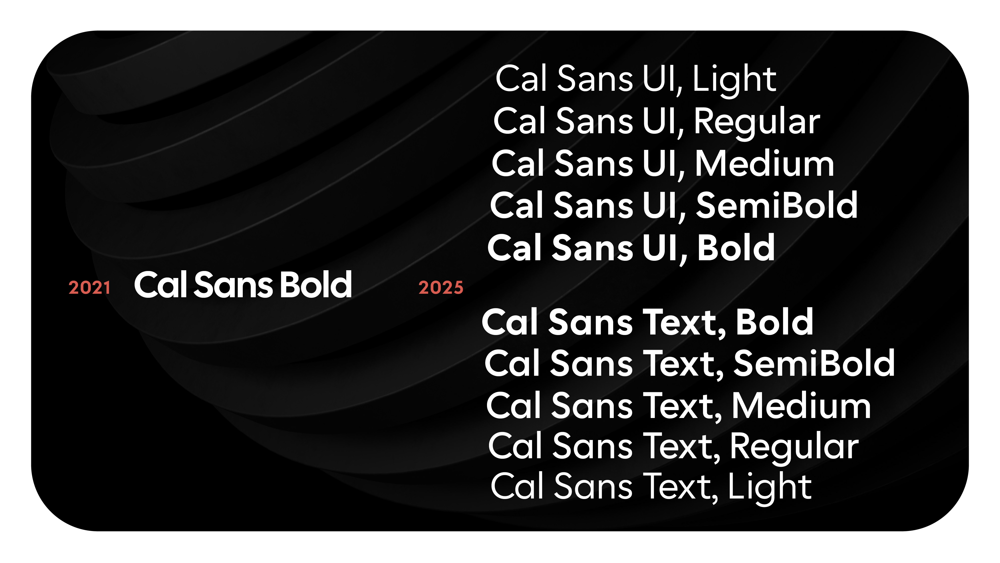
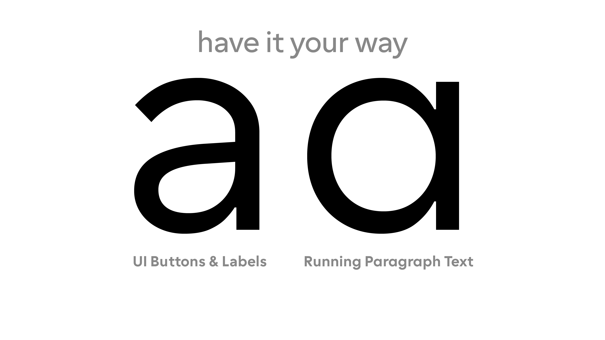
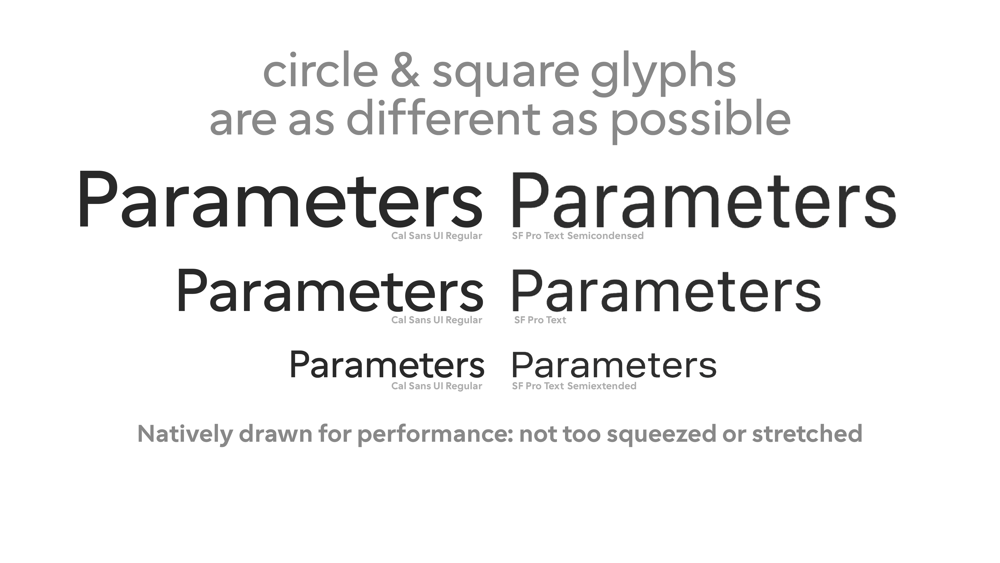
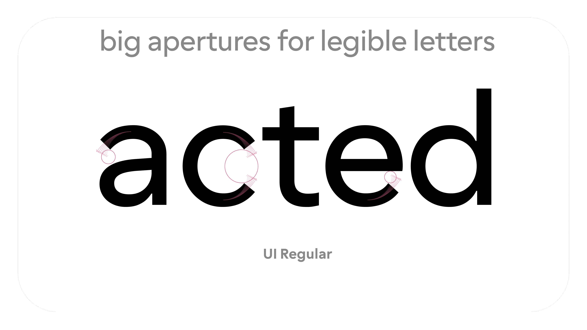
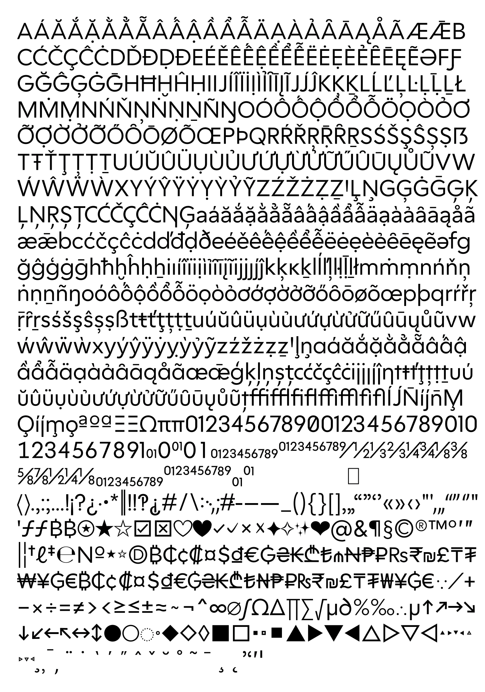

# Cal Sans UI Variable Font, and Cal Sans UI and Cal Sans Text Families

Introducing two new families, **Cal Sans UI** and **Cal Sans Text**. Every detail is re-considered for readers, product designers, and developers at the same time. **Cal Sans UI** is also a variable font, built with stylistic variations to both approach through a `MODE` (UI or Text Mode) axis.



Futura is a legendary typeface however its proportions and metrics defy web and app constrictions. However, only changing an x-height makes text run too long. Hence begun a 5-month exploration to make a light master *and* make every glyph slightly narrower while retaining the friendly, geometric appearance that has many visual benefits. The text version retains the Futura-style **a** and **G** plus the friendly Cal.com-style punctuation. Either families can change details via stylistic sets; choosing a family is a lot easier. Both come in 5 styles, many latin diacritics including Vietnamese and Marshalleese, a many dingbats, common symbols, and a single one-color emoji.


Essential for disambiguation-heavy short texts and numeral/letter mixed environments, our friend the double story a makes its debut. It literally took Mark months and cost him sleep. But he’s stoked with it ✨


We decided not to depart far from the original proportions of **Cal Sans** (2021) as the fairly modest x-height didn’t cost line-length compared to SF Pro/Inter.


The true test of the much-hyped accessibility, readability, or legibility is if it just *works* in the practically expected *in*opportune conditions: moving your eyes quickly, poor light, screen too far, or a litany of inevitable degenerative optical conditions (including my dad, a web accessiblity engeneer who has also lost 60% of sight accuity in one eye). You just blur it.

Cal Sans UI and Cal Sans Text has nearly a thousand glyphs and components, nearly 300 more glyphs than the previous release. And 3,000 kerns.


## 🧰 Build Instructions

1. **Install dependencies**
   ```bash
   pip install -r requirements.txt
