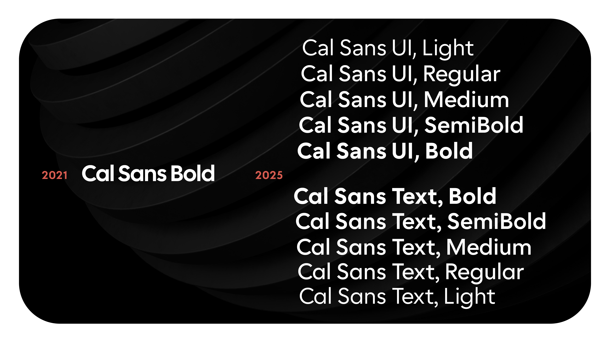
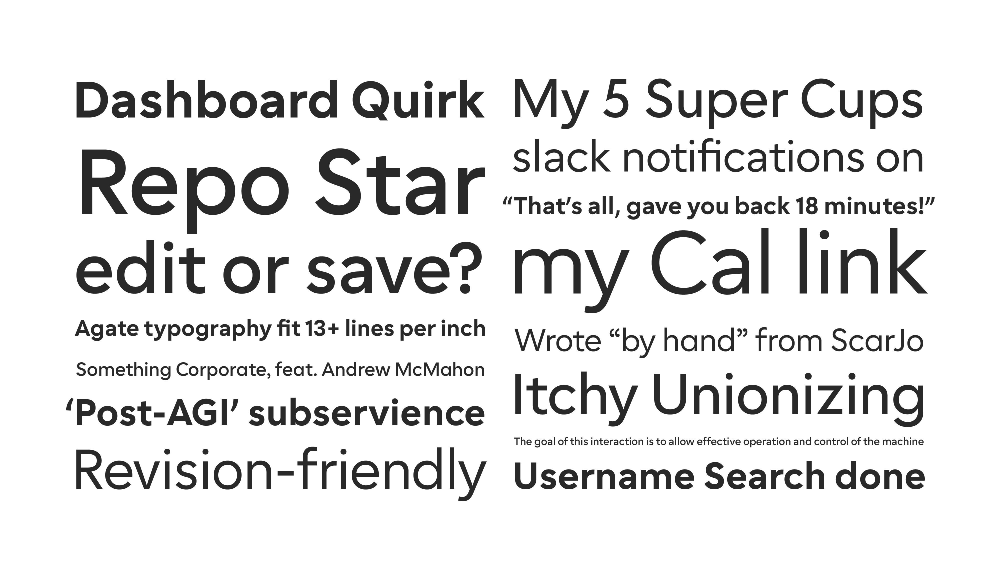
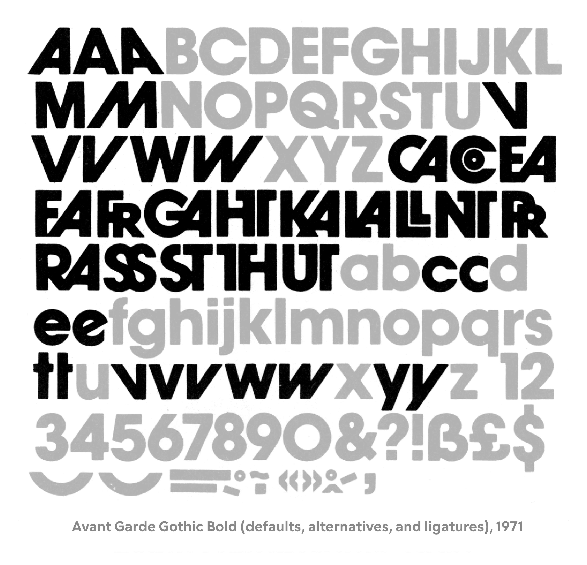
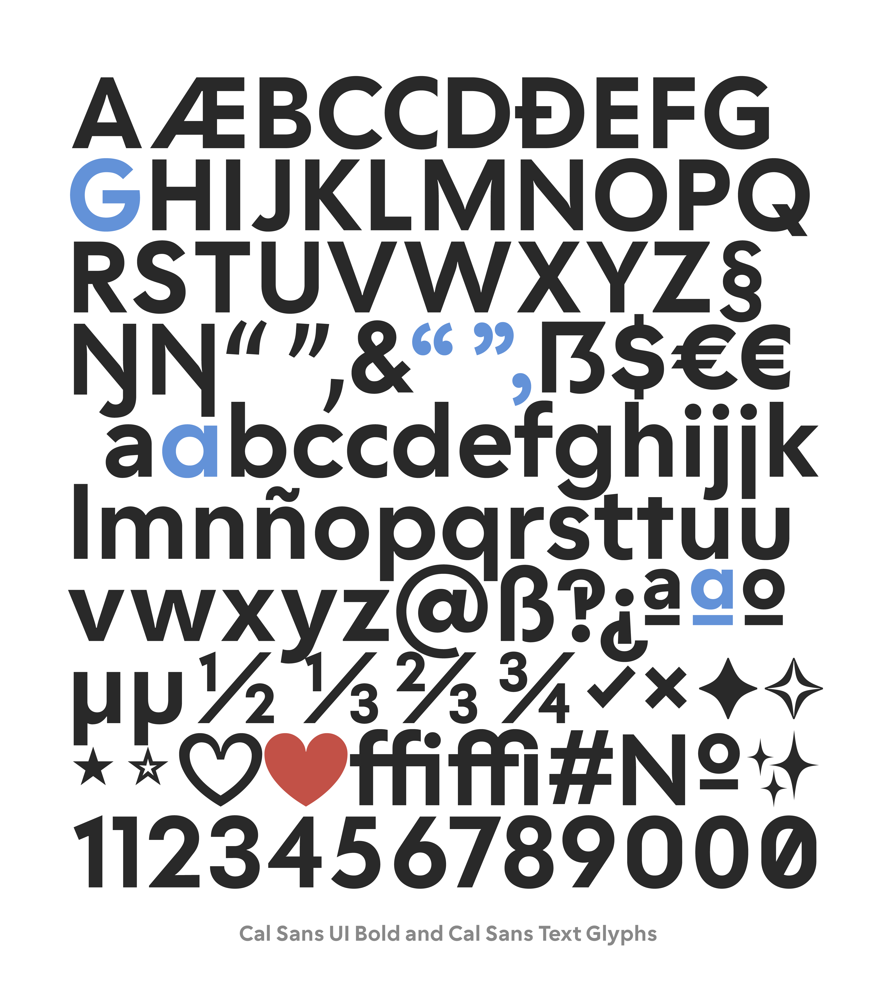
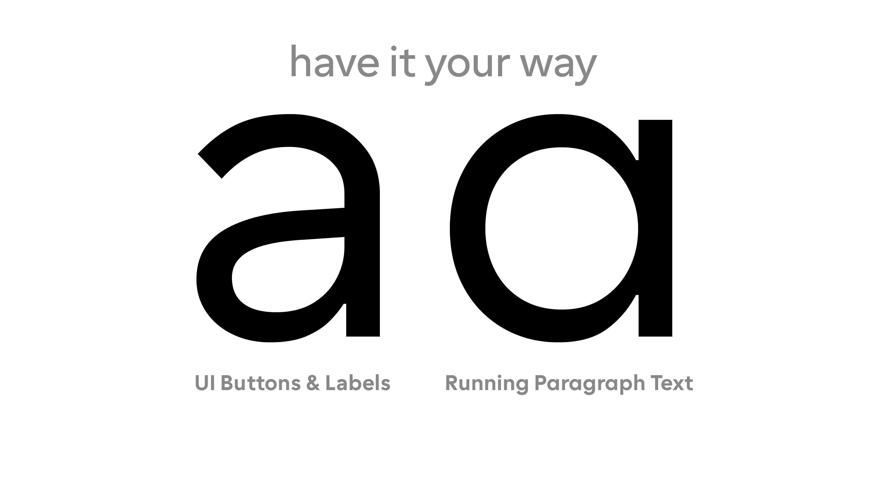
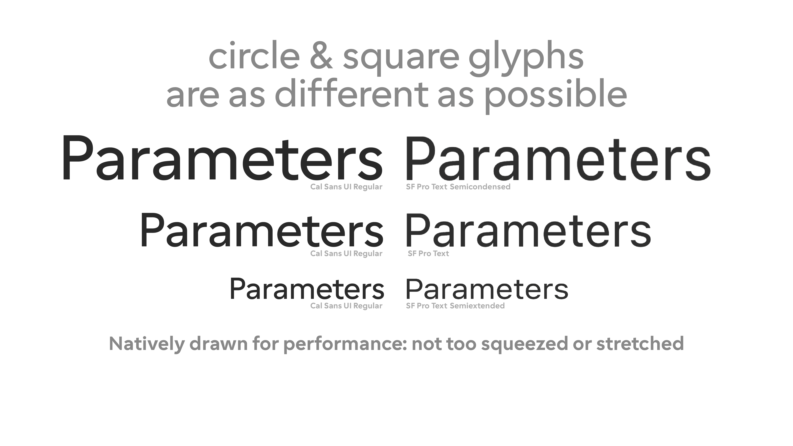
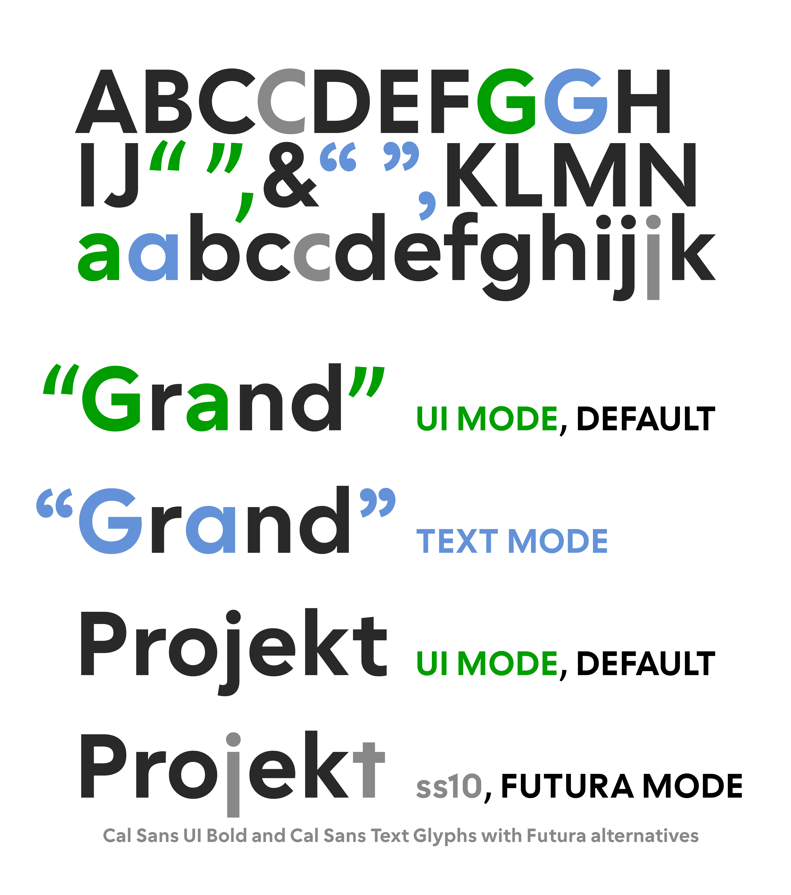
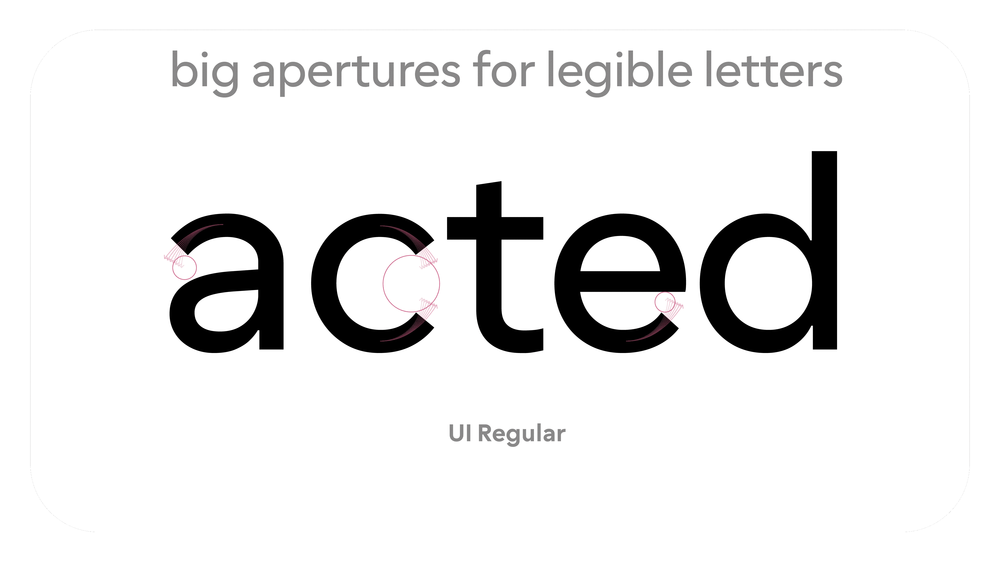

# Cal Sans UI V1.0.1 Variable Font, and Cal Sans UI and Cal Sans Text Families


Copyright (c) 2025, Mark Davis mark@designermarkdavis.com, with typefaces “Cal Sans UI” and “Cal Sans Text.” Commissioned by Peer Richelsen for Cal.com. This Font Software is licensed under the SIL Open Font License, Version 1.1. This license is copied below, and is also available with a FAQ at: https://openfontlicense.org

<!-- markdownlint-disable MD033 MD036 MD041 -->


Geometric sans-serif typeface to populate the interfaces of Cal.com

## Install (npm)

For Next.js, Vite, CRA, or any app that can import CSS:

```bash
npm i @calcom/cal-sans-ui
```

**Next.js:** peer dependency Next.js 13.2+

### How to import

**Next.js (App Router):**

```tsx
import { CalSansUI } from "@calcom/cal-sans-ui/ui";
import { CalSansText } from "@calcom/cal-sans-ui/text";
import { CalSansGeo } from "@calcom/cal-sans-ui/geo";
// or: import { CalSansUI, CalSansText, CalSansGeo } from "@calcom/cal-sans-ui";
```

**Any other app (Vite, CRA, etc.):**

```tsx
import "@calcom/cal-sans-ui/ui.css";
import "@calcom/cal-sans-ui/text.css";
import "@calcom/cal-sans-ui/geo.css";
```

Then use `font-family: "Cal Sans UI"`, `"Cal Sans Text"`, or `"Cal Sans Geo"` in your CSS.

### Usage (Next.js App Router)

Next.js requires font loaders to be called at module scope:

```tsx
import { CalSansUI } from "@calcom/cal-sans-ui/ui";
import { CalSansText } from "@calcom/cal-sans-ui/text";
import { CalSansGeo } from "@calcom/cal-sans-ui/geo";

export default function RootLayout({ children }) {
  return (
    <html lang="en" className={`${CalSansUI.variable} ${CalSansText.variable} ${CalSansGeo.variable}`}>
      <body>{children}</body>
    </html>
  );
}
```

Use the CSS variables and variation settings in Tailwind or CSS:

```css
h1 {
  font-family: var(--font-cal-sans-text), sans-serif;
  font-variation-settings: "GEOM" 50;
}

p {
  font-family: var(--font-cal-sans-ui), sans-serif;
  font-variation-settings: "GEOM" 0;
}

.geo h1, .geo p {
  font-family: var(--font-cal-sans-geo), sans-serif;
  font-variation-settings: "GEOM" 100;
}
```

Or apply the font class directly:

```tsx
<h1 className={CalSansGeo.className}>Heading</h1>
<p className={CalSansUI.className}>Body text</p>
<h1 className={CalSansText.className} style={{ fontVariationSettings: '"GEOM" 50' }}>Heading</h1>
```

### Non-Next.js (Vite, CRA, etc.)

Import the CSS and use the font family names in your styles. For browsers that don't support variable fonts, use `@calcom/cal-sans-ui/ui-non-variable.css` instead.

### Exports

| Import | Description |
|--------|--------------|
| `@calcom/cal-sans-ui` | Next: `CalSansUI`, `CalSansUINonVariable`, `CalSansText`, `CalSansGeo` (all in one). **Preferred.** |
| `@calcom/cal-sans-ui/ui` | Next: `CalSansUI` (variable). |
| `@calcom/cal-sans-ui/ui-non-variable` | Next: `CalSansUINonVariable` (static UI). |
| `@calcom/cal-sans-ui/text` | Next: `CalSansText` (variable subheadings). |
| `@calcom/cal-sans-ui/geo` | Next: `CalSansGeo` (variable). |
| `@calcom/cal-sans-ui/ui.css` | CSS: variable font. |
| `@calcom/cal-sans-ui/ui-non-variable.css` | CSS: static UI weights. |
| `@calcom/cal-sans-ui/text.css` | CSS: Cal Sans Text. |
| `@calcom/cal-sans-ui/geo.css` | CSS: Cal Sans Geo. |

---

Introducing two new families, **Cal Sans UI** and **Cal Sans Text** designed by Mark Davis for [Cal.com](https://refer.cal.com/davis). Every detail is reconsidered for readers, product designers, and developers at the same time. **Cal Sans UI** is also a variable font, built with stylistic variations to both approach through a `MODE` (UI or Text Mode) axis, and a traditional weight axis with a MVP range of Light ↔ Bold. Since advising Peer Richelsen in 2021 on the typography needed at the start of his Cal.com journey, the open-source font landscape for UI had not changed. This is why it felt like an excellent opportunity to add more to the conversation and a new tool to choose from. Cal Sans UI and Cal Sans Text work perfectly at all point-sizes, but it has been optimized at the pixel-level for between 14–15px UI interfaces with high-DPI screen target. It can also be deployed skilfully and successfully at larger or smaller sizes, but if going much bigger with shorter texts or single words, consider Cal Sans instead. 


## Variable axes

| Axes            | Tag        | Range      | Default    | Description                                                                                  |
| :-------------- | :--------- | :--------- | :--------- | :------------------------------------------------------------------------------------------- |
| UI to Text Mode | MODE       | 0 – 1      | 0          | Change **a**, **G**, and **“ ” ‘ ’ , ; ' "** characters for UI or Branding/Text Applications | 
| Weight          | wght       | 300 – 700  | 400        | Light – Bold                                                                                 |


### Why are there two families?
There were many use cases and applications of a small-size version of the un-changed headline font, and the opportunity was too enticing to have a future [fully responsive single font with an optical size axis](https://www.reddit.com/r/typography/comments/1lhs7j5/cal_sans_but_with_a_size_axisopen_source_and/). So! We simply kept both and for this release all can use whatever works best. Also we anticipate future integration [with the Google Fonts API that does not allow stylistic sets](https://x.com/MarkFonts/status/1968066680762012039) and it is Mark’s personally held belief that designers better understood how to use alternative letters when they had to rub them down manually themselves like [Letraset](https://www.eyemagazine.com/feature/article/rub-down-revolution) sheets or catalogues, not stare down optionless webfont testing pages or even premium fonts that happen to have alternatives by surprise.


To get to where we are, we have made changes to the previous design. The first change was the lower case dimensions—lengthening extenders like ascenders and descenders, and lowered all the x-heights. This makes the sentence shape more discernible around the few capitals. While shortening and also lengthening lowercase characters, we have slightly flattened all circular characters by approximately 7–8% of their original width in circularity, for a little more economy compared to Grotesks and the display style. We have added minuscule gaps to stroke joins, all terminals have been rotated away from their counters forms by 8%. 40–42 units were added to all sidebearings, or the built-in spacing in the left and right side of glyphs, compared to [**Cal Sans** (2021)](https://github.com/calcom/sans). So, yes, it is still tighter than in-market Open Source UI fonts, so we apologize that designers will not be able to farm engagement pictures with Cal Sans UI using tiny annotations of letterspacing adjustments.


Futura is a legendary typeface; however, its proportions and metrics defy web and app constrictions. Changing only x-heights makes text run too long. We underwent a 5-month exploration to make a light master *and* make every glyph slightly narrower, while retaining the friendly, geometric appearance which has many visual benefits. The text version retains the Futura-style **a** and **G**, plus the friendly Cal.com-style punctuation. Based on your needs, you can change details via stylistic sets, and choosing a family is now a lot easier. Both sets come in 5 styles, and contain Latin diacritics (including Vietnamese and Marshalleese), many dingbats, common symbols, and a single one-color emoji.


Essential for disambiguation-heavy short texts and numeral/letter mixed environments, our friend, the double story a, makes its debut. It took Mark many months and lost him much sleep, but he’s quite pleased with it ✨


We did not depart too far from the original proportions of [**Cal Sans**](https://github.com/calcom/sans). The modest x-heights didn’t cost line-length (as compared to SF Pro/Inter).


The true test of the much-hyped accessibility, readability, or legibility is if it just *works* in the practically expected *in*opportune conditions: moving your eyes quickly, poor light, screen too far, or the long list of inevitable degenerative optical conditions (including my dad, a web accessibility engineer who has also lost 60% of sight acuity in one eye). You just blur it.


Cal Sans UI and Cal Sans Text has nearly a thousand glyphs and components, nearly 300 more glyphs than the previous release. And 3,000 kerns.

## Latin Language Support
Afrikaans • Albanian • Asturian • Asu • Azerbaijani • Basque • Bemba • Bena • Bosnian • Breton • Catalan • Cebuano • Chiga • Colognian • Cornish • Corsican • Croatian • Czech • Danish • Embu • English • Esperanto • Estonian • Faroese • Filipino • Finnish • French • Friulian • Galician • Ganda • German • Gusii • Haitian Creole • Hawaiian • Hungarian • Icelandic • Ido • Igbo • Inari Sami • Indonesian • Interlingua • Irish • Italian • Javanese • Jju • Jola-Fonyi • Kabuverdianu • Kalaallisut • Kalenjin • Kamba • Kikuyu • Kinyarwanda • Latvian • Lithuanian • Lojban • Lower Sorbian • Luo • Luxembourgish • Luyia • Machame • Makhuwa-Meetto • Makonde • Malagasy • Malay • Maltese • Manx • Māori • Mapuche • Marshalleese • Meru • Mohawk • Morisyen • Mvskoke • North Ndebele • North Sámi • Northern Sotho • Norwegian Bokmål • Norwegian Nynorsk • Nyanja • Nyankole • Occitan • Oromo • Pite Sámi • Polish • Portuguese • Quechua • Romanian • Romansh • Rombo • Rundi • Rwa • Samburu • Samoan • Sango • Sangu • Sardinian • Scottish Gaelic • Sena • Serbian • Shambala • Shona • Sicilian • Slovak • Slovenian • Soga • Somali • South Ndebele • Southern Sotho • Spanish • Sundanese • Swahili • Swati • Swedish • Swiss German • Taita • Taroko • Teso • Tongan • Tsonga • Tswana • Turkish • Turkmen • Ume Sámi • Upper Sorbian • Uzbek • Vietnamese • Vunjo • Walloon • Welsh • Wolastoqey • Wolof • Xhosa • Zulu

## Special Thanks

Thank you to Peer for commissioning this project. I wanted to also thank Wei Huang for his Open Source “Perfect Glyphs Example File” that is [Work Sans dot glyphs](https://github.com/weiweihuanghuang/Work-Sans/blob/master/sources/WorkSans.glyphs). Incredibly helpful, and exhibits genius.

The following people were invaluable to this project, in no specific order, with an undisclosed amount of personal (or impersonal) influence:

- Paul Renner
- Roger Black, David Berlow, Tobias Frere-Jones, Matthew Carter, Jonathan Hoefler
- Hannes Famira, Cara Di Edwardo, Andy Clymer, David Jonathan Ross, Thomas Jockin
- [ArrowType’s Type-x Chrome Extension](github.com/arrowtype/type-x) [Chrome Store Link](https://chromewebstore.google.com/detail/type-x/paelebbajjhdmomglaffoachiepobeag)
- Eva Roa my love, ᴡᴏʀᴅᴍᴀʀᴋ COO and resident Python expert and evaGPT terminal; Doriel Jacov
- As Cal Sans Text and Cal Sans UI is the fruit of my labor, I am the fruit of Scott & Lori Davis


# 🧰 Build Instructions

## Step 1: Virtual environment & requirements

### Navigate to the root directory
```
cd [folder location]
```

### Set up a virtual environment in the root directory

```
virtualenv -p python3 venv
```

### Activate the virtual environment

```
source venv/bin/activate
```

### Install requirements

```
pip install -U -r requirements.txt
```

You might also need to install ttfautohint

```
brew install ttfautohint
```


## Step 2: Build the fonts


### Navigate to /sources
Assuming you are already in the root directory

```
cd sources
```

<!-- **Note:** The alternative Text glyphs are produced using stylistic sets in the source file. If you want to include new glyphs for Text Mode, please ensure to generate them at position `[0,5<MODE<1]` in the Text to UI Mode axis. -->


### Build designspace file in /master_ufo

```
sh build_ds.sh
```

**Notes:** 

- Run this command every time you make changes to the source file.
- Once you update the designspace, paste the contents of the `RulesFeatureVariations.txt` file into your .designspace file.

### Build OTvar and TTF fonts

```
gftools builder config.yaml
```

<!-- ### Build static TTF fonts

```
sh build-statics.sh
``` -->