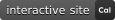
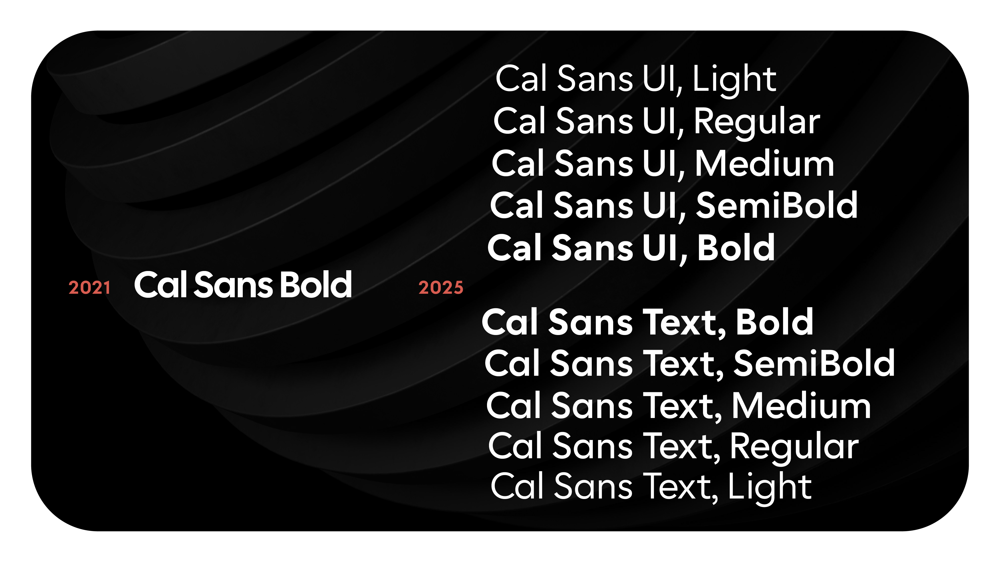
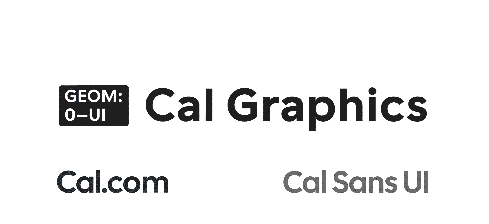
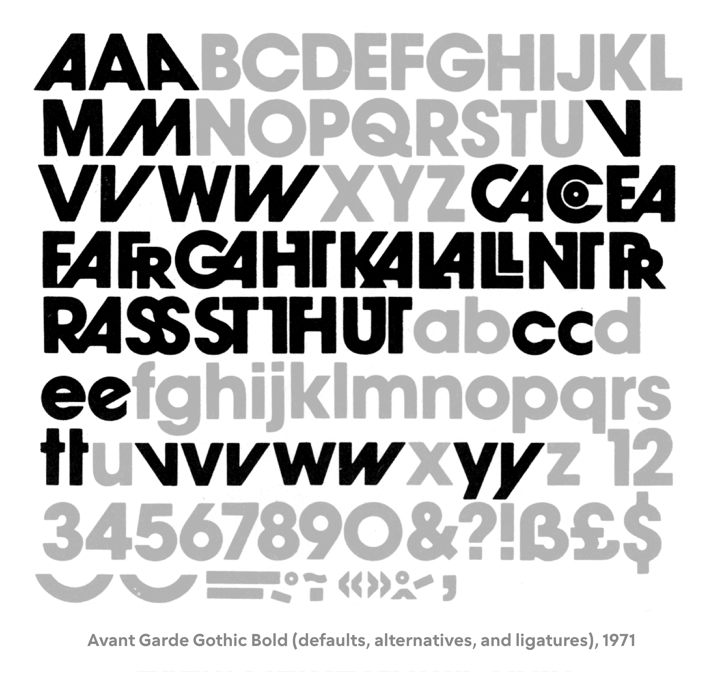
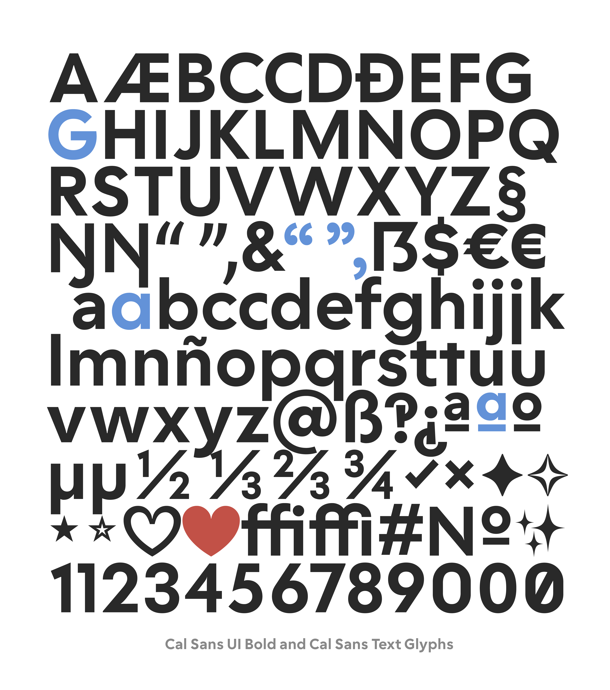
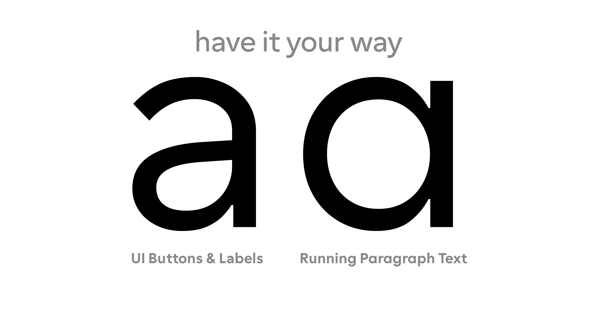
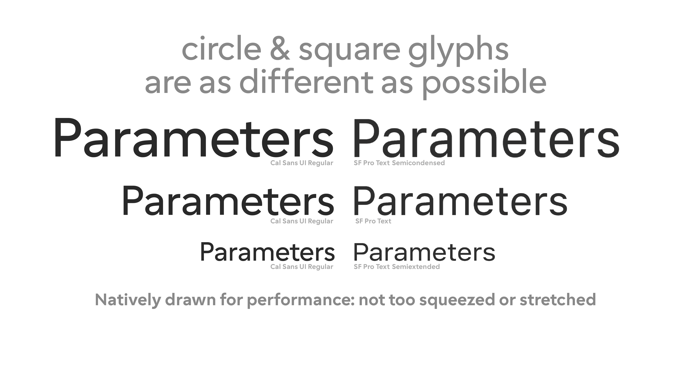
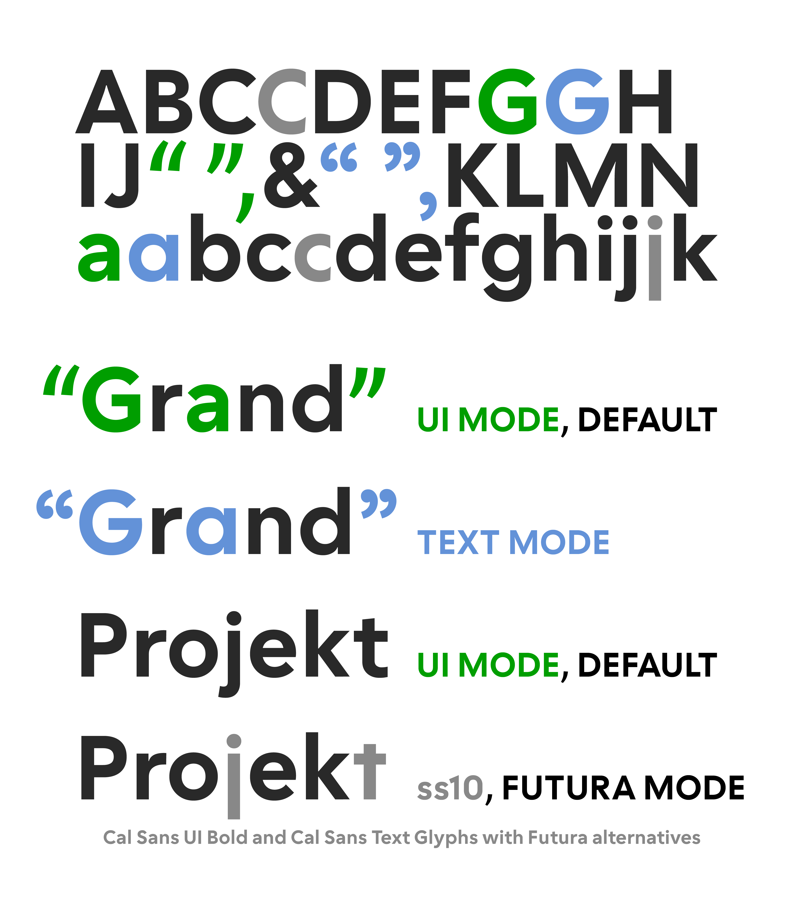
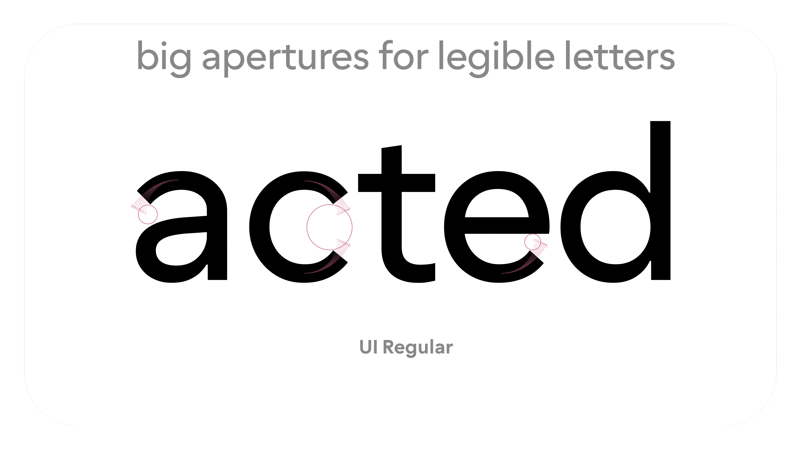

# Cal Sans Text UI v2.003 — the UI cut of Cal Sans v2


Copyright (c) 2026, Mark Davis mark@wordmark.nyc, with typefaces “Cal Sans UI,” “Cal Sans Text,” and “Cal Sans Geo.” Commissioned by Peer Richelsen for Cal.com. This Font Software is licensed under the SIL Open Font License, Version 1.1. This license is copied below, and is also available with a FAQ at: https://openfontlicense.org

<!-- markdownlint-disable MD033 MD036 MD041 -->


[](https://cal.com/font)


> **Official Showcase:** Explore the interactive specimens, test the variable axes, drag stickers around, and see the origin story at [cal.com/font](https://cal.com/font). Teasers have been added to the repo as GIFs.
> 

**Cal Sans Text UI** is the interface cut of [Cal Sans v2](https://github.com/calcom/sans), designed by Mark Davis for [Cal.com](https://refer.cal.com/davis). One family, one live axis: set the weight between 400 and 700 and everything else is already decided — the 10 pt drawing, the UI geometry, raised ascenders, drawn italics. It is optimized at the pixel level for 14–15px interfaces on high-DPI screens, and works well either side of that; for headlines and short display settings, reach for [Cal Sans](https://github.com/calcom/sans) itself, which carries the full optical-size and geometry axes.

## Variable axes

| Axis   | Tag    | Range     | Default | Description        |
| :----- | :----- | :-------- | :------ | :----------------- |
| Weight | `wght` | 400–700   | 400     | Regular–Bold       |

Every other axis is frozen at the Text UI position, so the file stays small and
nothing needs configuring:

| Frozen | Value  | Why |
| :----- | :----- | :-- |
| `opsz` | 10     | The 10 pt drawing — blunter corners, wider spacing, built for reading. |
| `GEOM` | 25     | The UI cut of the geometry axis. |
| `YTAS` | 1520   | Ascenders raised from the 1440 default, for more open sentence shapes at text size. |
| `SHRP` | 0      | Unsharpened corners. |

Italics are drawn at 9.5°, not slanted, and style-link from `font-style: italic`.


## Install (npm)

For Next.js, Vite, CRA, or any app that can import CSS:

```bash
npm i @calcom/cal-sans-ui
```

**Next.js:** peer dependency Next.js 13.2+

### How to import

**Next.js (App Router):**

```tsx
import { CalSansUI } from "@calcom/cal-sans-ui/ui";
// or: import { CalSansUI, CalSansUINonVariable } from "@calcom/cal-sans-ui";
```

**Any other app (Vite, CRA, etc.):**

```tsx
import "@calcom/cal-sans-ui/ui.css";
```

Then use `font-family: "Cal Sans Text UI"` in your CSS.

### Usage (Next.js App Router)

Next.js requires font loaders to be called at module scope:

```tsx
import { CalSansUI } from "@calcom/cal-sans-ui/ui";

export default function RootLayout({ children }) {
  return (
    <html lang="en" className={`${CalSansUI.variable}`}>
      <body>{children}</body>
    </html>
  );
}
```

### With Tailwind CSS

Map Cal Sans to Tailwind's theme variables so you can use `font-sans` (body), `font-heading` (headings), and `font-display` (geo):

**Tailwind v4** – `tailwind.css`:

```css
@theme {
  --font-sans: var(--font-cal-sans-ui), ui-sans-serif, sans-serif;
  --font-heading: var(--font-cal-sans-ui), ui-sans-serif, sans-serif;
}
```

**Tailwind v3** – `tailwind.config.js`:

```js
module.exports = {
  theme: {
    extend: {
      fontFamily: {
        sans: ["var(--font-cal-sans-ui)", "sans-serif"],
        heading: ["var(--font-cal-sans-ui)", "sans-serif"],
      },
    },
  },
};
```

Then use the utilities in your components:

```tsx
<p className="font-sans">Body text uses Cal Sans Text UI</p>
<p className="font-sans italic">Italics are drawn, not slanted</p>
<h1 className="font-sans font-semibold">Headings use the same family at 600</h1>
```

Weight is the only live axis, so reach for it directly:

```tsx
<h2 className="font-sans" style={{ fontWeight: 600 }}>Subheading</h2>
```

Or in plain CSS:

```css
h1 {
  font-family: var(--font-cal-sans-ui), sans-serif;
  font-weight: 600;
}
```

> `GEOM`, `opsz`, `YTAS` and `SHRP` are frozen in this cut, so
> `font-variation-settings: "GEOM" 50` will not error — it will silently do nothing.
> If you want those axes live, use the full
> [Cal Sans variable font](https://github.com/calcom/sans) instead.

### Non-Next.js (Vite, CRA, etc.)

Import the CSS and use the font family names in your styles. For browsers that don't support variable fonts, use `@calcom/cal-sans-ui/ui-non-variable.css` instead.

### Exports

| Import | Description |
|--------|--------------|
| `@calcom/cal-sans-ui` | Next: `CalSansUI`, `CalSansUINonVariable`. **Preferred.** |
| `@calcom/cal-sans-ui/ui` | Next: `CalSansUI` (variable, roman + italic). |
| `@calcom/cal-sans-ui/ui-non-variable` | Next: `CalSansUINonVariable` (8 statics). |
| `@calcom/cal-sans-ui/ui.css` | CSS: variable font, roman + italic. |
| `@calcom/cal-sans-ui/ui-non-variable.css` | CSS: 4 weights × roman/italic. |

## Further Documentation

### Where did Cal Sans UI, Text and Geo go?

As of v2.0.0 this package ships a single family, **Cal Sans Text UI** — the UI cut of
[Cal Sans v2](https://github.com/calcom/sans), instanced at the coordinates above. The
three 1.x families are archived at tag [`1.500`](https://github.com/calcom/sans-ui/releases/tag/1.500),
and the geometry they exposed through `GEOM` now lives on the `GEOM` axis of the full
Cal Sans variable font. The design notes below describe that 1.x work.

### Why there were three families

*The images in this section document the 1.x families, which are archived at tag [`1.500`](https://github.com/calcom/sans-ui/releases/tag/1.500).*





There were many use cases and applications of a small-size version of the un-changed headline font, and the opportunity was too enticing to have a future [fully responsive single font with an optical size axis](https://www.reddit.com/r/typography/comments/1lhs7j5/cal_sans_but_with_a_size_axisopen_source_and/). So! We simply kept both and for this release all can use whatever works best. Also we anticipate future integration [with the Google Fonts API that does not allow stylistic sets](https://x.com/MarkFonts/status/1968066680762012039) and it is Mark’s personally held belief that designers better understood how to use alternative letters when they had to rub them down manually themselves like [Letraset](https://www.eyemagazine.com/feature/article/rub-down-revolution) sheets or catalogues, not stare down optionless webfont testing pages or even premium fonts that happen to have alternatives by surprise.


To get to where we are, we have made changes to the previous design. The first change was the lower case dimensions—lengthening extenders like ascenders and descenders, and lowered all the x-heights. This makes the sentence shape more discernible around the few capitals. While shortening and also lengthening lowercase characters, we have slightly flattened all circular characters by approximately 7–8% of their original width in circularity, for a little more economy compared to Grotesks and the display style. We have added minuscule gaps to stroke joins, all terminals have been rotated away from their counters forms by 8%. 40–42 units were added to all sidebearings, or the built-in spacing in the left and right side of glyphs, compared to [**Cal Sans** (2021)](https://github.com/calcom/sans). So, yes, it is still tighter than in-market Open Source UI fonts, so we apologize that designers will not be able to farm engagement pictures with Cal Sans UI using tiny annotations of letterspacing adjustments.


Futura is a legendary typeface; however, its proportions and metrics defy web and app constrictions. Changing only x-heights makes text run too long. We underwent a 5-month exploration to make a light master *and* make every glyph slightly narrower, while retaining the friendly, geometric appearance which has many visual benefits. The `GEOM` 50 Text version retains the Futura-style **a** and **G**. Set `GEOM` to 100 and find a family extremely Bauhaus. All sets come in 5 styles, and contain Latin diacritics (including Vietnamese and Marshalleese), many dingbats, common symbols, and a single one-color emoji.


Essential for disambiguation-heavy short texts and numeral/letter mixed environments, our friend, the double story a, makes its debut. It took Mark many months and lost him much sleep, but he’s quite pleased with it ✨


We did not depart too far from the original proportions of [**Cal Sans**](https://github.com/calcom/sans). The modest x-heights didn’t cost line-length (as compared to SF Pro/Inter).


The true test of the much-hyped accessibility, readability, or legibility is if it just *works* in the practically expected *in*opportune conditions: moving your eyes quickly, poor light, screen too far, or the long list of inevitable degenerative optical conditions (including my dad, a web accessibility engineer who has also lost 60% of sight acuity in one eye). You just blur it.


Cal Sans UI, Cal Sans Text, and Cal Sans Geo has nearly a thousand glyphs and components, nearly 300 more glyphs than the previous release. And 3,000 kerns.

---

## Latin Language Support
Afrikaans • Albanian • Asturian • Asu • Azerbaijani • Basque • Bemba • Bena • Bosnian • Breton • Catalan • Cebuano • Chiga • Colognian • Cornish • Corsican • Croatian • Czech • Danish • Embu • English • Esperanto • Estonian • Faroese • Filipino • Finnish • French • Friulian • Galician • Ganda • German • Gusii • Haitian Creole • Hawaiian • Hungarian • Icelandic • Ido • Igbo • Inari Sami • Indonesian • Interlingua • Irish • Italian • Javanese • Jju • Jola-Fonyi • Kabuverdianu • Kalaallisut • Kalenjin • Kamba • Kikuyu • Kinyarwanda • Latvian • Lithuanian • Lojban • Lower Sorbian • Luo • Luxembourgish • Luyia • Machame • Makhuwa-Meetto • Makonde • Malagasy • Malay • Maltese • Manx • Māori • Mapuche • Marshalleese • Meru • Mohawk • Morisyen • Mvskoke • North Ndebele • North Sámi • Northern Sotho • Norwegian Bokmål • Norwegian Nynorsk • Nyanja • Nyankole • Occitan • Oromo • Pite Sámi • Polish • Portuguese • Quechua • Romanian • Romansh • Rombo • Rundi • Rwa • Samburu • Samoan • Sango • Sangu • Sardinian • Scottish Gaelic • Sena • Serbian • Shambala • Shona • Sicilian • Slovak • Slovenian • Soga • Somali • South Ndebele • Southern Sotho • Spanish • Sundanese • Swahili • Swati • Swedish • Swiss German • Taita • Taroko • Teso • Tongan • Tsonga • Tswana • Turkish • Turkmen • Ume Sámi • Upper Sorbian • Uzbek • Vietnamese • Vunjo • Walloon • Welsh • Wolastoqey • Wolof • Xhosa • Zulu

## Special Thanks

Thank you to Peer for commissioning this project. I wanted to also thank Wei Huang for his Open Source “Perfect Glyphs Example File” that is [Work Sans dot glyphs](https://github.com/weiweihuanghuang/Work-Sans/blob/master/sources/WorkSans.glyphs). Incredibly helpful, and exhibits genius.

The following people were invaluable to this project, in no specific order, with an undisclosed amount of personal (or impersonal) influence:

- Paul Renner
- Roger Black, David Berlow, Tobias Frere-Jones, Matthew Carter, Jonathan Hoefler
- Hannes Famira, Cara Di Edwardo, Andy Clymer, David Jonathan Ross, Thomas Jockin
- [ArrowType’s Type-x Chrome Extension](github.com/arrowtype/type-x) [Chrome Store Link](https://chromewebstore.google.com/detail/type-x/paelebbajjhdmomglaffoachiepobeag)
- Eva Roa my love, ᴡᴏʀᴅᴍᴀʀᴋ COO and resident Python expert and evaGPT terminal; Doriel Jacov
- As Cal Sans Text and Cal Sans UI is the fruit of my labor, I am the fruit of Scott & Lori Davis


## Upgrading from 1.x

Measured against the [`1.500`](https://github.com/calcom/sans-ui/releases/tag/1.500) build.

**Text will not reflow.** Cap height (721 → 720) and x-height (514 → 514) are unchanged
per 1000 em, and a line of UI copy runs within 1% at every shared weight. Existing layouts
keep their line breaks.

**What changes:**

| | 1.500 | 2.003 | Note |
|---|---|---|---|
| Weight range | 300–700 | 400–700 | **Light is gone.** `font-weight: 300` now clamps to 400. |
| Regular/Medium colour | — | ~10% lighter | Stems at 400 and 500 are lighter; 600 and 700 are identical. |
| `GEOM` axis | 0–100 | frozen at 25 | `font-variation-settings: "GEOM" …` silently does nothing. |
| Default line box | 1.12 em | 1.30 em | Set `line-height` explicitly if you relied on the default. |
| Italics | none | drawn, 9.5° | `font-style: italic` now reaches a real italic instead of a synthesized slant. |
| Stylistic sets | 5 sets, 8 variants | **20 sets, 42 variants** | Nothing is subset out — see the numbering warning below. |
| Glyphs | 1069 | 1546 | |
| Characters | 682 | 695 | 15 added; `U+00AD` soft hyphen and `U+0335` combining short stroke overlay dropped. |
| Package exports | `./ui` `./text` `./geo` | `./ui` | `./text` and `./geo` are removed. |

> **`ss02` and `ss06` changed meaning.** The alternates are renumbered on Cal Sans v2's
> scheme, so three tags now reshape a different letter than they did in 1.x. Old feature
> strings will not error — they will quietly do the wrong thing.
>
> | tag | 1.500 | 2.003 |
> |---|---|---|
> | `ss01` | Single-story a | Geometric a |
> | `ss02` | UI G | **Humanist a** |
> | `ss06` | Flat y | **Geometric G** |
> | `ss10`, `ss11` | Futura alternatives (+ ligations) | unchanged |
>
> The full catalogue is in
> [Cal Sans' character-alternatives doc](https://github.com/calcom/sans/blob/main/documentation/character-alternatives.md).

The three families are archived at tag `1.500` and remain installable as
`@calcom/cal-sans-ui@1.3.0`.

# Update log
* v2.0.0 — Replaced the three 1.x families with **Cal Sans Text UI**, the Text UI cut of Cal Sans v2.003: one live axis (`wght` 400–700) with `opsz` 10, `GEOM` 25, `YTAS` 1520 and `SHRP` 0 frozen, roman + drawn italics. Breaking: `./text` and `./geo` are removed.
* v1.500 — Updated fonts with GEOM variable axis to Open Source the optical qualities better on Google Fonts
* v1.000 — Launch Fonts

# 🧰 Build Instructions

The fonts here are no longer built from `sources/CalSansUI.glyphs`. They are cuts of
[Cal Sans v2](https://github.com/calcom/sans), produced by that repo's compiler:

```bash
git clone https://github.com/calcom/sans && cd sans
python3 -m scripts
```

The Text UI cut is defined in `scripts/config.py` as `GF_TEXTUI_PINNED`, and lands in
`fonts/calsans-gf-api-textui/` (variable) and `fonts/calsans-gf-workspace/` (statics).
Copy those into `fonts/` and `packages/npm/dist/fonts/` here.

The 1.x pipeline below is kept for the archived `1.500` sources.

## Step 1: Virtual environment & requirements

### Navigate to the root directory
```
cd [folder location]
```

### Set up a virtual environment in the root directory

```
virtualenv -p python3 venv
```

### Activate the virtual environment

```
source venv/bin/activate
```

### Install requirements

```
pip install -U -r requirements.txt
```

You might also need to install ttfautohint

```
brew install ttfautohint
```


## Step 2: Build the fonts


### Navigate to /sources
Assuming you are already in the root directory

```
cd sources
```

<!-- **Note:** The alternative Text glyphs are produced using stylistic sets in the source file. If you want to include new glyphs for Text Mode, please ensure to generate them at position `[0,5<MODE<1]` in the Text to UI Mode axis. -->


### Build designspace file in /master_ufo

```
sh build_ds.sh
```

**Notes:** 

- Run this command every time you make changes to the source file.
- Once you update the designspace, paste the contents of the `RulesFeatureVariations.txt` file into your .designspace file.

### Build OTvar and TTF fonts

```
gftools builder config.yaml
```

<!-- ### Build static TTF fonts

```
sh build-statics.sh
``` -->