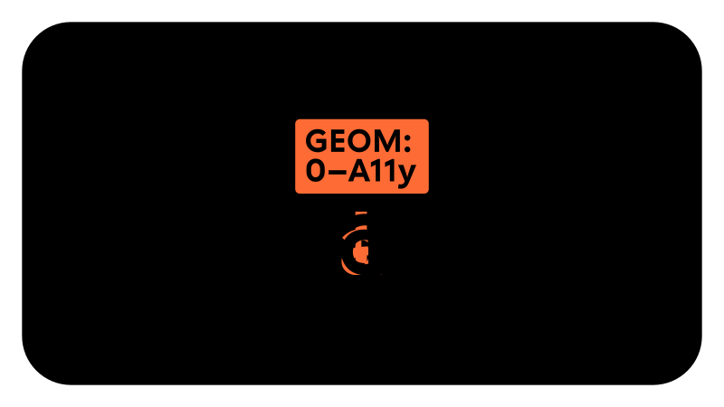
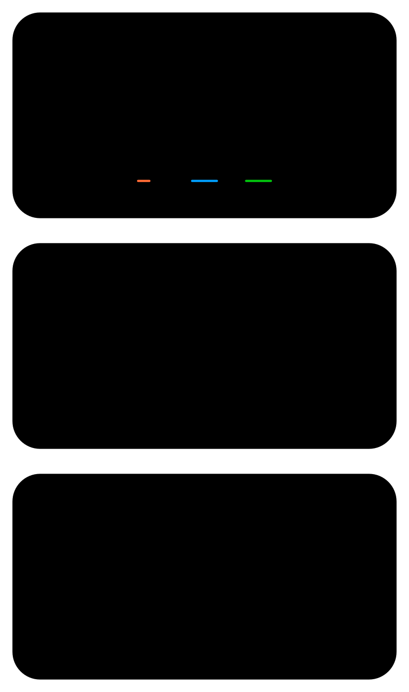

# Cal Sans Text UI v2.003 — the UI cut of Cal Sans v2


Copyright (c) 2026, Mark Davis mark@wordmark.nyc, with typefaces “Cal Sans UI,” “Cal Sans Text,” and “Cal Sans Geo.” Commissioned by Peer Richelsen for Cal.com. This Font Software is licensed under the SIL Open Font License, Version 1.1. This license is copied below, and is also available with a FAQ at: https://openfontlicense.org

<!-- markdownlint-disable MD033 MD036 MD041 -->


[](https://cal.com/font)


<picture>
  <source media="(prefers-color-scheme: dark)" srcset="documentation/images/svg/UIComponents-dark.svg">
  
</picture>

<picture>
  <source media="(prefers-color-scheme: dark)" srcset="documentation/images/svg/Stickers-dark.svg">
  
</picture>

> **Official Showcase:** Explore the interactive specimens, test the variable axes, drag stickers around, and see the origin story at [cal.com/font](https://cal.com/font). Teasers have been added to the repo as GIFs.
> 

**Cal Sans Text UI** is the interface cut of [Cal Sans v2](https://github.com/calcom/sans), designed by Mark Davis for [Cal.com](https://refer.cal.com/davis). One family, one live axis: set the weight between 400 and 700 and everything else is already decided — the 10 pt drawing, the UI geometry, raised ascenders, drawn italics. It is optimized at the pixel level for 14–15px interfaces on high-DPI screens, and works well either side of that; for headlines and short display settings, reach for [Cal Sans](https://github.com/calcom/sans) itself, which carries the full optical-size and geometry axes.

## Variable axes

| Axis                | Tag    | Range       | Default | Description |
| :------------------ | :----- | :---------- | :------ | :---------- |
| Weight              | `wght` | 400–700     | 400     | Regular–Bold |
| Geometric Formality | `GEOM` | 0–100       | 25      | A11y (0) → UI (25) → Base (50) → Geo (100) |
| Ascender Height     | `YTAS` | 1440–1600   | 1520    | Raised from the 1440 default for more open sentence shapes at text size |
| Sharp               | `SHRP` | 0–100       | 0       | Corner sharpness |
| Italic              | `ital` | 0–1         | 0       | Upright to the drawn 9.5° italic |

<picture>
  <source media="(prefers-color-scheme: dark)" srcset="documentation/images/svg/CalGraphics-top-dark.svg">
  
</picture>

Every Cal Sans v2 axis is live here except one:

| Frozen | Value | Why |
| :----- | :---- | :-- |
| `opsz` | 10    | The interface drawing throughout — no 8 pt, no 45 pt. Everything else stays adjustable. |

> **Italic is an axis, not a second face.** `font-style: italic` cannot reach a
> variable axis, so `<em>` and `<i>` will not italicise from the variable file
> alone — ask for it directly, and restate any other axes you rely on, because
> `font-variation-settings` resets what it omits:
> ```css
> em { font-variation-settings: "ital" 1, "GEOM" 25, "YTAS" 1520; }
> ```
> The static faces in `ui-non-variable.css` ship drawn italics per weight, so
> `font-style: italic` works normally there.

> **`GEOM` 0 changes more than shape.** At the A11y end, `rclt` swaps in the
> seriffed **I** and curved **l** on its own, with no feature applied — shaping
> "Il1" at `GEOM` 0 returns `I.rcltA11y` and `l.rcltA11y`. At the default 25 you
> get the plain forms. `GEOM` 100 also switches the numeral **1**.

<picture>
  <source media="(prefers-color-scheme: dark)" srcset="documentation/images/svg/Weight-dark.svg">
  
</picture>

Every other axis is frozen at the Text UI position, so the file stays small and
nothing needs configuring:

| Frozen | Value  | Why |
| :----- | :----- | :-- |
| `opsz` | 10     | The 10 pt drawing — blunter corners, wider spacing, built for reading. |
| `GEOM` | 25     | The UI cut of the geometry axis. |
| `YTAS` | 1520   | Ascenders raised from the 1440 default, for more open sentence shapes at text size. |
| `SHRP` | 0      | Unsharpened corners. |

<picture>
  <source media="(prefers-color-scheme: dark)" srcset="documentation/images/svg/Italic-dark.svg">
  
</picture>


## Alternates and disambiguation

Nothing is subset out of this cut: **20 stylistic sets and 42 character variants** ship, toggled wherever OpenType features are exposed. The full catalogue lives in [Cal Sans' character-alternatives doc](https://github.com/calcom/sans/blob/main/documentation/character-alternatives.md).

<picture>
  <source media="(prefers-color-scheme: dark)" srcset="documentation/images/svg/StylisticSets-dark.svg">
  
</picture>

### Three ways to make it yours

<picture>
  <source media="(prefers-color-scheme: dark)" srcset="documentation/images/svg/CalThreeWays-dark.svg">
  
</picture>

The curved **l** is the default lowercase l in this family, drawn to separate I, l and 1 at interface sizes. `cv16` returns the constructed l if you would rather have it.

<picture>
  <source media="(prefers-color-scheme: dark)" srcset="documentation/images/svg/Disambiguation-dark.svg">
  
</picture>

> Two caveats found while testing this build: `ss17` (Geometric/legible 6 and 9) has no plain
> `six`/`nine` in its input set, so it only takes effect together with `ss16`; and `ss20`
> ("Horizontal Sharps") maps `Z`/`z`/`5`, not the sharp s.

## Install (npm)

For Next.js, Vite, CRA, or any app that can import CSS:

```bash
npm i @calcom/cal-sans-ui
```

**Next.js:** peer dependency Next.js 13.2+

### Use it

**Next.js (App Router).** The package ships a `next/font/local` wrapper:

```tsx
import { CalSansUI } from "@calcom/cal-sans-ui/ui";

export default function RootLayout({ children }) {
  return (
    <html lang="en" className={CalSansUI.variable}>
      <body>{children}</body>
    </html>
  );
}
```

**Anywhere else** — Vite, CRA, plain HTML — import the stylesheet and use the
family name:

```tsx
import "@calcom/cal-sans-ui/ui.css";
```
```css
body { font-family: "Cal Sans Text UI", sans-serif; }
```

**Tailwind.** Point a family at the CSS variable the wrapper sets:

```js
// tailwind.config.js
theme: { extend: { fontFamily: { sans: ["var(--font-cal-sans-ui)", "sans-serif"] } } }
```

### Exports

| Import | Description |
|--------|--------------|
| `@calcom/cal-sans-ui` | Next: `CalSansUI`, `CalSansUINonVariable`. **Preferred.** |
| `@calcom/cal-sans-ui/ui` | Next: `CalSansUI` (variable, roman + italic). |
| `@calcom/cal-sans-ui/ui-non-variable` | Next: `CalSansUINonVariable` (8 statics). |
| `@calcom/cal-sans-ui/ui.css` | CSS: variable font, roman + italic. |
| `@calcom/cal-sans-ui/ui-non-variable.css` | CSS: 4 weights × roman/italic. |

## Further Documentation

### Where did Cal Sans UI, Text and Geo go?

As of v2.0.0 this package ships a single family, **Cal Sans Text UI** — the UI cut of
[Cal Sans v2](https://github.com/calcom/sans), instanced at the coordinates above. The
three 1.x families are archived at tag [`1.500`](https://github.com/calcom/sans-ui/releases/tag/1.500),
and the geometry they exposed through `GEOM` now lives on the `GEOM` axis of the full
Cal Sans variable font. The design notes below describe that 1.x work.

### Why there were three families

*The images in this section document the 1.x families, which are archived at tag [`1.500`](https://github.com/calcom/sans-ui/releases/tag/1.500).*


There were many use cases and applications of a small-size version of the un-changed headline font, and the opportunity was too enticing to have a future [fully responsive single font with an optical size axis](https://www.reddit.com/r/typography/comments/1lhs7j5/cal_sans_but_with_a_size_axisopen_source_and/). So! We simply kept both and for this release all can use whatever works best. Also we anticipate future integration [with the Google Fonts API that does not allow stylistic sets](https://x.com/MarkFonts/status/1968066680762012039) and it is Mark’s personally held belief that designers better understood how to use alternative letters when they had to rub them down manually themselves like [Letraset](https://www.eyemagazine.com/feature/article/rub-down-revolution) sheets or catalogues, not stare down optionless webfont testing pages or even premium fonts that happen to have alternatives by surprise.


To get to where we are, we have made changes to the previous design. The first change was the lower case dimensions—lengthening extenders like ascenders and descenders, and lowered all the x-heights. This makes the sentence shape more discernible around the few capitals. While shortening and also lengthening lowercase characters, we have slightly flattened all circular characters by approximately 7–8% of their original width in circularity, for a little more economy compared to Grotesks and the display style. We have added minuscule gaps to stroke joins, all terminals have been rotated away from their counters forms by 8%. 40–42 units were added to all sidebearings, or the built-in spacing in the left and right side of glyphs, compared to [**Cal Sans** (2021)](https://github.com/calcom/sans). So, yes, it is still tighter than in-market Open Source UI fonts, so we apologize that designers will not be able to farm engagement pictures with Cal Sans UI using tiny annotations of letterspacing adjustments.


Futura is a legendary typeface; however, its proportions and metrics defy web and app constrictions. Changing only x-heights makes text run too long. We underwent a 5-month exploration to make a light master *and* make every glyph slightly narrower, while retaining the friendly, geometric appearance which has many visual benefits. The `GEOM` 50 Text version retains the Futura-style **a** and **G**. Set `GEOM` to 100 and find a family extremely Bauhaus. All sets come in 5 styles, and contain Latin diacritics (including Vietnamese and Marshalleese), many dingbats, common symbols, and a single one-color emoji.


Essential for disambiguation-heavy short texts and numeral/letter mixed environments, our friend, the double story a, makes its debut. It took Mark many months and lost him much sleep, but he’s quite pleased with it ✨


We did not depart too far from the original proportions of [**Cal Sans**](https://github.com/calcom/sans). The modest x-heights didn’t cost line-length (as compared to SF Pro/Inter).


The true test of the much-hyped accessibility, readability, or legibility is if it just *works* in the practically expected *in*opportune conditions: moving your eyes quickly, poor light, screen too far, or the long list of inevitable degenerative optical conditions (including my dad, a web accessibility engineer who has also lost 60% of sight acuity in one eye). You just blur it.


Cal Sans UI, Cal Sans Text, and Cal Sans Geo has nearly a thousand glyphs and components, nearly 300 more glyphs than the previous release. And 3,000 kerns.

---

## Latin Language Support
Afrikaans • Albanian • Asturian • Asu • Azerbaijani • Basque • Bemba • Bena • Bosnian • Breton • Catalan • Cebuano • Chiga • Colognian • Cornish • Corsican • Croatian • Czech • Danish • Embu • English • Esperanto • Estonian • Faroese • Filipino • Finnish • French • Friulian • Galician • Ganda • German • Gusii • Haitian Creole • Hawaiian • Hungarian • Icelandic • Ido • Igbo • Inari Sami • Indonesian • Interlingua • Irish • Italian • Javanese • Jju • Jola-Fonyi • Kabuverdianu • Kalaallisut • Kalenjin • Kamba • Kikuyu • Kinyarwanda • Latvian • Lithuanian • Lojban • Lower Sorbian • Luo • Luxembourgish • Luyia • Machame • Makhuwa-Meetto • Makonde • Malagasy • Malay • Maltese • Manx • Māori • Mapuche • Marshalleese • Meru • Mohawk • Morisyen • Mvskoke • North Ndebele • North Sámi • Northern Sotho • Norwegian Bokmål • Norwegian Nynorsk • Nyanja • Nyankole • Occitan • Oromo • Pite Sámi • Polish • Portuguese • Quechua • Romanian • Romansh • Rombo • Rundi • Rwa • Samburu • Samoan • Sango • Sangu • Sardinian • Scottish Gaelic • Sena • Serbian • Shambala • Shona • Sicilian • Slovak • Slovenian • Soga • Somali • South Ndebele • Southern Sotho • Spanish • Sundanese • Swahili • Swati • Swedish • Swiss German • Taita • Taroko • Teso • Tongan • Tsonga • Tswana • Turkish • Turkmen • Ume Sámi • Upper Sorbian • Uzbek • Vietnamese • Vunjo • Walloon • Welsh • Wolastoqey • Wolof • Xhosa • Zulu

## Special Thanks

Thank you to Peer for commissioning this project. I wanted to also thank Wei Huang for his Open Source “Perfect Glyphs Example File” that is [Work Sans dot glyphs](https://github.com/weiweihuanghuang/Work-Sans/blob/master/sources/WorkSans.glyphs). Incredibly helpful, and exhibits genius.

The following people were invaluable to this project, in no specific order, with an undisclosed amount of personal (or impersonal) influence:

- Paul Renner
- Roger Black, David Berlow, Tobias Frere-Jones, Matthew Carter, Jonathan Hoefler
- Hannes Famira, Cara Di Edwardo, Andy Clymer, David Jonathan Ross, Thomas Jockin
- [ArrowType’s Type-x Chrome Extension](github.com/arrowtype/type-x) [Chrome Store Link](https://chromewebstore.google.com/detail/type-x/paelebbajjhdmomglaffoachiepobeag)
- Eva Roa my love, ᴡᴏʀᴅᴍᴀʀᴋ COO and resident Python expert and evaGPT terminal; Doriel Jacov
- As Cal Sans Text and Cal Sans UI is the fruit of my labor, I am the fruit of Scott & Lori Davis


## Upgrading from 1.x

Measured against the [`1.500`](https://github.com/calcom/sans-ui/releases/tag/1.500) build.

**Text will not reflow.** Cap height (721 → 720) and x-height (514 → 514) are unchanged
per 1000 em, and a line of UI copy runs within 1% at every shared weight. Existing layouts
keep their line breaks.

**What changes:**

| | 1.500 | 2.003 | Note |
|---|---|---|---|
| Weight range | 300–700 | 400–700 | **Light is gone.** `font-weight: 300` now clamps to 400. |
| Regular/Medium colour | — | ~10% lighter | Stems at 400 and 500 are lighter; 600 and 700 are identical. |
| `GEOM` axis | 0–100 | 0–100, default 25 | Still live; the default moves from 0 to 25 (UI). |
| Default line box | 1.12 em | 1.30 em | Set `line-height` explicitly if you relied on the default. |
| Italics | none | drawn, 9.5° on `ital` | New — but as an axis, so `font-style: italic` does not reach it in the variable file. |
| Stylistic sets | 5 sets, 8 variants | **20 sets, 42 variants** | Nothing is subset out — see the numbering warning below. |
| Glyphs | 1069 | 1546 | |
| Characters | 682 | 695 | 15 added; `U+00AD` soft hyphen and `U+0335` combining short stroke overlay dropped. |
| Package exports | `./ui` `./text` `./geo` | `./ui` | `./text` and `./geo` are removed. |

> **`ss02` and `ss06` changed meaning.** The alternates are renumbered on Cal Sans v2's
> scheme, so three tags now reshape a different letter than they did in 1.x. Old feature
> strings will not error — they will quietly do the wrong thing.
>
> | tag | 1.500 | 2.003 |
> |---|---|---|
> | `ss01` | Single-story a | Geometric a |
> | `ss02` | UI G | **Humanist a** |
> | `ss06` | Flat y | **Geometric G** |
> | `ss10`, `ss11` | Futura alternatives (+ ligations) | unchanged |
>
> The full catalogue is in
> [Cal Sans' character-alternatives doc](https://github.com/calcom/sans/blob/main/documentation/character-alternatives.md).

The three families are archived at tag `1.500` and remain installable as
`@calcom/cal-sans-ui@1.3.0`.

# Update log
* v2.0.0 — Replaced the three 1.x families with **Cal Sans Text UI**, a cut of Cal Sans v2.003 carrying every axis except `opsz`, which is frozen at 10: `wght` 400–700, `GEOM` 0–100, `YTAS` 1440–1600 (default raised to 1520), `SHRP` 0–100 and `ital` 0–1, unsubset, with drawn italics. Breaking: `./text` and `./geo` are removed.
* v1.500 — Updated fonts with GEOM variable axis to Open Source the optical qualities better on Google Fonts
* v1.000 — Launch Fonts

# 🧰 Build Instructions

These fonts are no longer built from `sources/CalSansUI.glyphs`. They are a cut of
[Cal Sans v2](https://github.com/calcom/sans), made from that repo's variable font
by pinning one axis and leaving the rest alone:

| | |
| :-- | :-- |
| Pinned | `opsz` 10 — the interface drawing, no 8 pt and no 45 pt |
| Live | `wght`, `GEOM`, `YTAS` (default raised to 1520), `SHRP`, `ital` |
| Not applied | the curved-l default swap that the Google Fonts Text UI cut uses |
| Not applied | the `ssXX`/`cvXX` subset that the Google Fonts cuts use |

The last two are what separate this from `calsans-gf-api-textui` in that repo,
which is otherwise pinned at the same place: this build keeps all 20 stylistic
sets and 42 character variants, and ships the plain `l` as default.

> **Not yet reproducible from a commit.** This cut is not defined in Cal Sans'
> `scripts/config.py`, so `python3 -m scripts` will not regenerate it — it was
> produced by instancing `fonts/calsans-var-full/CalSansVF.ttf` with those pins.
> Adding it there, alongside `GF_TEXTUI_PINNED`, is the outstanding job before
> anyone can rebuild what npm ships.

The archived 1.x pipeline lives at tag [`1.500`](https://github.com/calcom/sans-ui/releases/tag/1.500).
